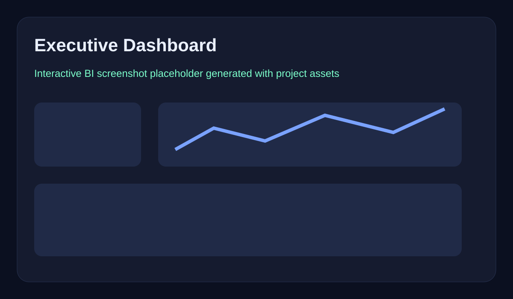
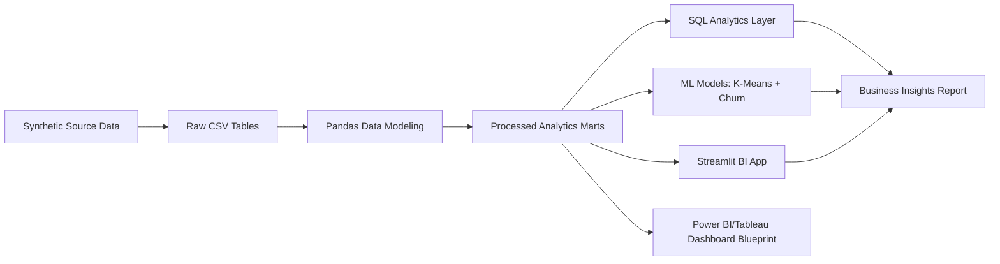
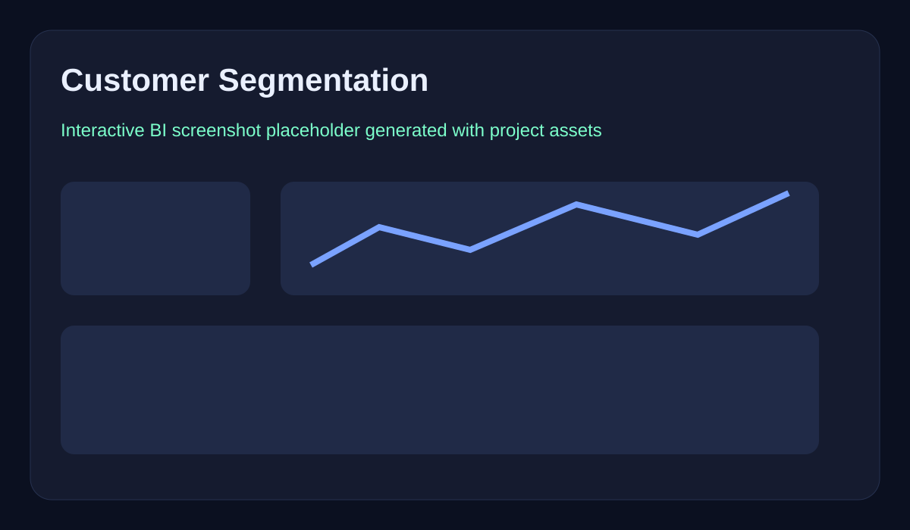
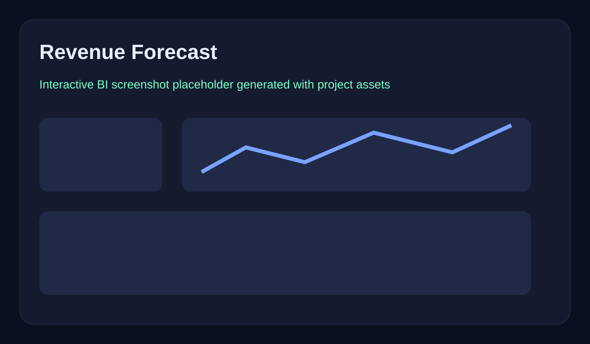

# E-Commerce Sales & Customer Behavior Analytics Platform

> Premium retail analytics platform for revenue growth, customer intelligence, churn risk, product performance, cohort retention, and executive marketplace reporting.

## Hero Section

**Marketplace Intelligence for Revenue, Retention, and Product Decisions** — a recruiter-ready analytics engineering case study that transforms transactional, customer, product, seller, payment, and review data into measurable business decisions.

## Project Overview

A portfolio-grade analytics engineering and BI project for an Amazon/Flipkart/Myntra-style e-commerce business. It combines synthetic transactional data, SQL analytics, machine learning, Streamlit BI, and dashboard design assets.



## Project Highlights

- **58,000 transactions**, **12,000 customers**, **650 products**, **120 sellers**
- Realistic seasonal sales, discount campaigns, returns, refunds, payment behavior, reviews, and fulfillment delays
- Advanced analytics: **RFM**, **K-Means segmentation**, **churn prediction**, **sales forecasting**, **cohort retention**, and recommendation seed logic
- 35 advanced SQL queries using CTEs, window functions, cohort logic, ranking, retention, and product analytics
- Interactive **Streamlit + Plotly** dashboard with filters, KPI cards, downloads, and forecasting
- Power BI/Tableau-ready semantic model assets and DAX measures

## Architecture



## Repository Structure

```text
ecommerce-sales-customer-analytics/
├── data/                 # raw and processed datasets
├── notebooks/            # analytics notebook
├── sql/                  # 35 advanced SQL queries
├── dashboard/            # HTML executive dashboard + Power BI blueprint
├── streamlit_app/        # interactive BI application
├── reports/              # business insights
├── visuals/              # dashboard screenshot-style assets
├── models/               # trained segmentation/churn artifacts
├── src/                  # reusable utilities
├── README.md
├── requirements.txt
└── .gitignore
```

## Dataset

| Table | Description |
|---|---|
| Orders | Transaction grain with revenue, discount, profit, returns, campaigns, shipping SLA |
| Customers | Demographics, geography, loyalty tier, acquisition channel |
| Products | Category, subcategory, price, standard margin |
| Sellers | Seller metadata, city, rating, onboarding date |
| Payments | Method, status, amount |
| Reviews | Rating and review text joined to orders/products |

## KPI Layer

**Sales:** Total Revenue, Profit Margin, Average Order Value, Monthly Growth Rate  
**Customer:** CLV, Repeat Purchase Rate, Churn Rate, Retention Rate  
**Product:** Best-Selling Products, Low Performing Categories, Return Rate  
**Operations:** Shipping Delay %, Refund %, Order Fulfillment Time

## Advanced Analytics

- **Customer segmentation:** K-Means on recency, frequency, monetary value, and returns
- **RFM analysis:** Champions, Loyal, Needs Attention, At Risk
- **Churn prediction:** Random Forest classifier for inactivity risk
- **Forecasting:** six-month revenue projection in Streamlit
- **Recommendation system seed:** category-level top product recommendations
- **Cohort analysis:** monthly retention cohort table

## Dashboard Pages

1. Executive Summary
2. Sales Analytics
3. Customer Analytics
4. Product Insights
5. Marketing Performance
6. Operational Analytics




## Business Impact Examples

See [`reports/business_insights.md`](reports/business_insights.md). Key examples generated from the dataset:

- Top 20% customers contribute **74.0%** of customer revenue
- Discount campaigns increase order volume but compress margins
- High-return categories create measurable profit leakage
- Repeat customers have materially higher average order value than one-time customers

## Screenshots


## Installation Guide

```bash
python -m venv .venv
source .venv/bin/activate
pip install -r requirements.txt
streamlit run streamlit_app/app.py
```

## Run Locally

```bash
python -m venv .venv
source .venv/bin/activate
pip install -r requirements.txt
streamlit run streamlit_app/app.py
```

## Deployment Guide

- Deploy the static executive dashboard from `public/index.html` on Vercel.
- Run the Streamlit app locally or deploy separately on Streamlit Community Cloud.
- Keep processed CSV marts in `data/processed/` as the stable semantic layer for BI tools.

## Performance Notes

- Static dashboard path gives recruiters a fast zero-backend preview.
- Processed marts keep dashboard reads lightweight and repeatable.
- ML artifacts are stored in `models/` so modeling outputs can be inspected without rerunning the full pipeline.
- BI pages are separated by executive, customer, product, marketing, and operations themes for maintainable storytelling.

## SQL Analytics

Open [`sql/advanced_analytics_queries.sql`](sql/advanced_analytics_queries.sql) for 35 production-style SQL queries covering revenue trends, retention, ranking, customer segmentation, campaign performance, operational SLA, and cohort analysis.

## BI Deployment Notes

- Import processed CSVs from `data/processed/` into Power BI or Tableau
- Use `dashboard/powerbi/measures.dax` for reusable KPI measures
- Recreate the six dashboard pages using the dark UI design in `dashboard/executive_dashboard.html`

## Future Improvements

- Add dbt models and tests
- Deploy Streamlit Community Cloud
- Add CI checks for data quality
- Replace linear forecast with Prophet/XGBoost time-series model
- Add user-based collaborative filtering for recommendations

## Resume Value

Demonstrates analytics engineering, customer analytics, SQL depth, ML segmentation, churn modeling, forecasting, BI storytelling, and executive dashboard packaging for Data Analyst, Product Analyst, BI Developer, and Analytics Engineering roles.
